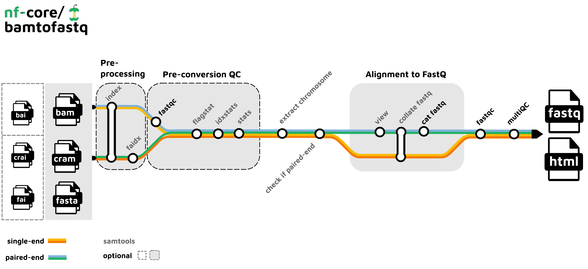

# A Brief View on Nextflow

Nextflow is a powerful pipelining tool that allows reproducible and efficient processing of bioinformatic datasets. Specifically, some advantages:

- Standardises the inputs & outputs between pipeline stages
- Can process files simultaneously
- Can manage submission to queueing systems

## Two core ideas: processes and channels

Everything in Nextflow is built from two things:

- **Processes** are the steps that do the work — they run a command, a script or a tool.
- **Channels** are the conveyor belts that carry data between processes. A process waits for items to arrive on its input channel, runs once per item (in parallel where possible), and emits its results onto an output channel.

The `|` (pipe) in a workflow simply connects one channel to the next, much like piping in bash.

## A basic nextflow script

With nextflow already installed (see the [Nextflow installation guide](https://www.nextflow.io/docs/latest/install.html)), it is simple to run a script. Lets start with this simple script. 

It has two parameters — ```seqs``` (a comma-separated list of sequences) and ```motif``` (the binding site to search for) — and two processes: ```calcGC``` & ```hasTFBS```, both written in Python.

At the end it has the workflow, which will look familiar to bash scripting where it uses pipes to pass between each process.

Lets look closer at what's going on:
```
params.seqs  = 'ATGCGCGCAT,TTTTAAAATTTT,GGGCATGACTCAGGG'
params.motif = 'TGACTCA'   // AP-1 transcription factor binding site

process calcGC {
    input:
    val seq

    output:
    stdout

    script:
    """
    #!/usr/bin/env python
    seq = "${seq}".upper()
    gc = (seq.count("G") + seq.count("C")) / len(seq) * 100
    print(f"${seq}: GC = {gc:.1f}%")
    """
}

process hasTFBS {
    input:
    val seq

    output:
    stdout

    script:
    """
    #!/usr/bin/env python
    seq   = "${seq}".upper()
    motif = "${params.motif}".upper()
    print(f"${seq}: {motif} present = {'yes' if motif in seq else 'no'}")
    """
}

workflow {
    seqs = Channel.fromList(params.seqs.tokenize(','))
    seqs | calcGC  | view { it.trim() }
    seqs | hasTFBS | view { it.trim() }
}
```

> **Writing a process in Python:** the `#!/usr/bin/env python` shebang on the first line tells Nextflow to run the script body with Python rather than bash — you can use any language this way. Nextflow fills in the `${...}` placeholders (here `${seq}` and `${params.motif}`) *before* the script runs, so they arrive as literal values in the Python. If you ever need a literal `$` in the script itself, escape it as `\$`.

## Running a nextflow script file
Copy the file from the ```~/Shared_folder/Day4/nextflow/nextflow_tfbs_scan.nf``` (it's the same script shown above).

We can now run the script:
```
nextflow run nextflow_tfbs_scan.nf
N E X T F L O W  ~  version 26.04.0
Launching `nextflow_tfbs_scan.nf` [suspicious_picasso] DSL2 - revision: 74255f5b09
executor >  local (6)
[74/298d81] process > calcGC (2)  [100%] 3 of 3 ✔
[00/315642] process > hasTFBS (1) [100%] 3 of 3 ✔
ATGCGCGCAT: GC = 60.0%
TTTTAAAATTTT: GC = 0.0%
GGGCATGACTCAGGG: GC = 66.7%
ATGCGCGCAT: TGACTCA present = no
TTTTAAAATTTT: TGACTCA present = no
GGGCATGACTCAGGG: TGACTCA present = yes
```
Each of the three default sequences is fed through both processes — note `calcGC (3)` and `hasTFBS (3)`, one task per sequence, run independently from the same channel.

Now lets give it some more data. Any parameter can be changed from the command line when running using ```--``` and the parameter name. This script accepts a comma-separated list of sequences, and you can override the motif too.

Let's give it our own sequences and search for the CRE/ATF site `TGACGTCA`:

```
nextflow run nextflow_tfbs_scan.nf \
    --seqs "GCGCGCGC,ATTTAGGGTGACGTCAGCG,TTGACGTCATT" \
    --motif "TGACGTCA"
```
Each sequence again produces its own `calcGC` and `hasTFBS` task:
```
[88/1b102a] process > calcGC (3)  [100%] 3 of 3 ✔
[01/0f688d] process > hasTFBS (2) [100%] 3 of 3 ✔
GCGCGCGC: GC = 100.0%
ATTTAGGGTGACGTCAGCG: GC = 52.6%
TTGACGTCATT: GC = 36.4%
GCGCGCGC: TGACGTCA present = no
ATTTAGGGTGACGTCAGCG: TGACGTCA present = yes
TTGACGTCATT: TGACGTCA present = yes
```
## Where do my outputs go? The `work` folder

Every process runs in its own subfolder under `work/`, named with the hash you see in the executor output (e.g. `[88/1b102a]`). That folder holds the staged inputs, the exact script that was run, and the outputs. It's a bit complex, but does make it easy to find the exact files and steps if (when!) a step fails:

```
$ ls -a work/88/1b102a*/            #### Change this to your own location! Yours will be different!
.command.sh   .command.out   .command.log   .exitcode
```

`.command.sh` is the script, and `.command.out` captures whatever the process printed to stdout (our `calcGC` and `hasTFBS` results will be in here). Any files inputted will be linked to here, and any created will be placed here.

## Processing many real files in parallel

The sequence example above is small and without real outputs. In practice you point a channel at a set of files and let Nextflow process them independantly across your cores (or cluster) automatically. Lets use a pre-installed program and use `Channel.fromPath` to emit one item per matching file

```nextflow
params.reads = "/home/ubuntu/Share/Day4/nextflow/fastq/*_1.fastq.gz"


process fastqc {
    publishDir 'fastqc', mode: 'copy'

    input:
    path(reads)

    output:
    path "*_fastqc.{html,zip}"

    script:
    """
    fastqc ${reads}
    """
}

workflow {
    Channel.fromPath(params.reads) | fastqc
}

```
Note using `publishDir 'fastqc', mode: 'copy'` which instead of leaving the outputs in the `work` directory, it'll create a new folder and copy the relevant results out.

## Resuming
Sometimes processes will go wrong or break for reasons such as ran out of memory or storage, or an error in your code. Fortunately you don't need to go all the way from the beginning again, and the ```-resume``` flag lets Nextflow reuse the steps that already finished and only run what's new or changed.

The code you used actually had another funtion in there to run fastp. Uncomment the `fastp` line in the workflow and run again using the -resume flag

```
executor >  local (3)
[76/6fd401] fastqc (1)              [100%] 6 of 6, cached: 6 ✔
[5c/c8b299] fastp (SRR5222797_10pc) [100%] 3 of 3 ✔
```

Notice `cached: 6`. The fastqc inputs were unchanged so their results were reused from the first run, and only the  new process was actually trimmed. Without `-resume`, all would be reprocessed from scratch.


## Using containers in nextflow
You can have your pipeline pull its software automatically via singularity, docker, conda or several other methods, rather than installing anything yourself. Which engine to use is chosen at run time with the ```-profile``` parameter (e.g. `-profile singularity`). Separately, in a config file you can attach a specific container to a process using a selector such as `withLabel`.

Rather than depending on the programs being installed already, lets run fastp inside a **singularity** container so nothing needs installing locally. The `container` directive names the image, and turning on singularity in `nextflow.config` tells Nextflow to run every process through it (the docker image is pulled and converted automatically):

Here, any process labelled 'trimming' will use the container as found on dockerhub:

```
// nextflow.config — picked up automatically when in the launch directory
singularity.enabled    = true
singularity.autoMounts = true

process {
  withLabel: trimming {
     container = 'staphb/fastp:0.23.4'
  }
}
```

## Running a published pipeline
Many groups and individuals publish their own pipelines on github that you can directly reference, and nf-core exists as a semi-formalised repository of nextflow approved pipelines that follow some overall structural rules.

Lets test nfcore using a bam to fastq converter. Here's the pipeline from [nf-core/bamtofastq](https://nf-co.re/bamtofastq/2.1.0).



This is defined to use singularity for all programmes (no installations required!). Note I have limited the cpu and memory usage for this tutorial by passing a small config file with `-c`:
```
nextflow run nf-core/bamtofastq \
    -profile singularity \
    --input ~/Shared_folder/nextflow/bam_samplesheet.csv \
    --outdir bc2fq_output 
```

In this case, it is accessing the code from the nf-core repository, however often you'll want to download it and edit the configuration files yourself.

That can be done by cloning the repository. Read through the parameters and then run the pipeline as above:
```
git clone https://github.com/nf-core/bamtofastq
~~~~~~~
cd bamtofastq
nextflow run main.nf ...............
```

### The end!
This was a very quick and simple overview of the nextflow pipeline system and how to get started using it. It can be complex to start writing your own at first, but with the amount of published pipelines there are a lot of resources to lean on.

These workflows can grow and get significantly larger, and a good place to look for inspiration is the [RNAseq nf-core pipeline](https://nf-co.re/rnaseq/3.21.0) with a huge range of optional tools.

