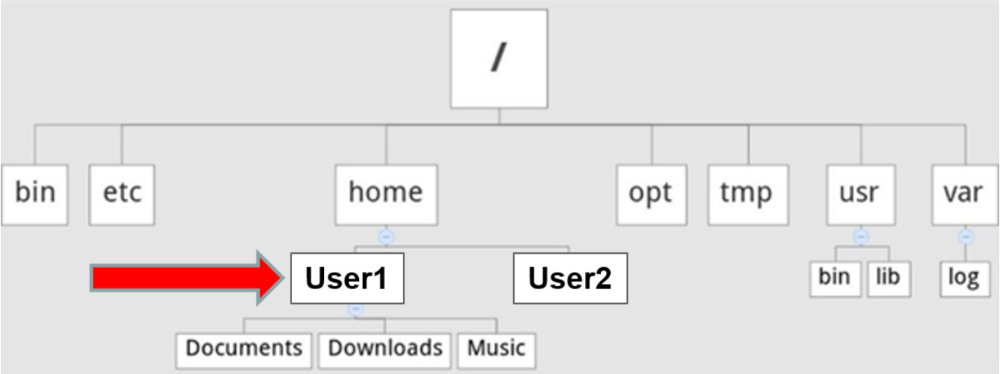
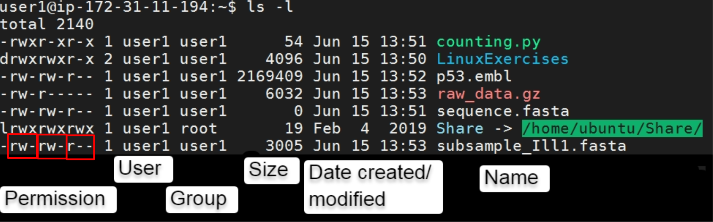

## Introduction to Linux

### Contents
- [General Reminders!](#general-reminders)
- [Anatomy of a Command](#anatomy-of-a-command)
- [Learning about Linux commands](#learning-about-linux-commands)
- [Changing Directories](#changing-directories)
- [Moving and copying data](#moving-and-copying-data)
- [Listing files in a directory](#listing-files-in-a-directory)
- [Visualising Text Files](#visualising-text-files)
- [Editing files](#editing-files)
- [Running and Reusing Scripts](#running-and-reusing-scripts)
- [Querying files with Grep](#querying-files-with-grep)
- [Reminders & Tips](#tips)

## General Reminders!
There is a lot of information in this booklet that is to help you with linux in general. Not every command applies right now and some are examples. You should only do the steps that follow the **EXERCISES** header, not every bit of code!

### When connecting to the server:
- Server IP address:  Changes daily
- Your username:      user + number i.e. ```user1```, ```user25```
- Your password:      A ```.pem``` file beginning with ```c``` & your number i.e. c1.pem, c25.pem

## Anatomy of a Command
The first item you supply on the command line is interpreted by the system as a command (something the system should do). Individual pieces of text that appear after it on the same line are separated by spaces. The additional input on the command line indicates to the system how the command should work. For example, what file you want the command to work on, or the format for the information that should be returned to you.

```
A general linux command:
What I want to do              How I want to do it           On what do I want to do it
```
Most commands have options available that will alter how they function. You make use of these options by providing the command with parameters (aka flags), some of which will take arguments and some won't require any. Occasionally this is because there are none available, but usually this is because the command will use default settings if nothing is specified.
```
# Examples
List files      Give extra details      On this folder
    ls               -l -a               /home/data

Read the file      For 20 lines         On this file
    head              -n 20              myfasta.fa
```
If a command runs successfully, it will **usually** not report anything back to you, unless reporting to you was the purpose. If the command does not execute properly, you will often see an error message returned. Whether or not the error is meaningful to you depends on your experience with Linux/Unix and how user-friendly the errors generated were designed to be.

As scripts and programs get more complex, they’ll have more parameters required i.e. input and outputs.
```
Convert format      Define Quality      Input file      Output file
fastq2Fasta.py          -Q 33          -i myseq.fq      -o myseq.fa
```
Note: Items on the command line separated by spaces are interpreted as individual pieces of information for the system. For this reason, a filename with a space in it will be interpreted as two filenames, as will some symbols. **This is important!**

Another important tip for using linux: pressing tab will auto complete a file name or program. If you’re writing a file named myFirstSequencingRun.fastq (see the no spaces!) and type just ‘myF’ and press tab, it will complete it for you which helps on typos. 

If there are multiple options with the same beginning then pressing tab twice will show the options. Most linux errors early on are because of typos or pointing to the wrong folder! Tab complete stops this, and if it won’t tab-complete then it doesn’t exist!

### EXERCISES
1. Use the ```ls``` command to see what files and folders are in your home directory
2. Use the ```-l``` flag with ```ls``` to see the full information. What type of object is ‘Share’ ?
3. Use ```ls``` on ‘Share’ to see what is inside the folder, and also explore the different sub-folders (use the ```/``` character between directories)
4. Use ```ls -lh``` on the file ```~/Shared_folder/Day1/subsample_Ill4.fasta``` but DON'T type out all the names. Using the tab key you should only need to press about 4 or 5 letters!

## Learning about Linux commands
Most Linux commands have a manual page that provides information about the command and options that can alter its behaviour.  Linux manual pages are referred to as man pages. 

To open the man page for a particular command, you just need to type man followed by the name of the command you are interested in.  To browse through a man page, use the cursor keys (↓ and ↑). To close the man page simply hit the q key on your keyboard.

### EXERCISES
1. Look up the manual information for the ```ls``` command. How would you have your files listed in order from when they were created?
2. Fastqc is a program we will use later for assessing sequence data quality. Look through the structure of the manual for fastqc using:

```
$ fastqc -h
# Or
$ fastqc -help
```
NOTE: often you’ll see linux commands begin with a ```$``` character. You don’t need to type this, it is how we identify a new line (You’ll see this as the first character when you log in).

## Changing Directories
The command used to change directories is cd.

If you think of your directory structure as a tree then the simplest directory change you can do is climb up or down into a folder directly above or below the one you are in.

Example directories (not your structure!)


Here, to change to a directory one below the current location you would use the cd command followed by the subdirectory name i.e. to move from User1 to ‘Downloads’:
```
$ cd Downloads
```
The shortcut for “the directory you are currently in” is a single full stop ( . ). If you type 
```
$ cd .  
```
nothing will change. Later, when we want to run scripts or copy to the current folder we will use this shortcut to mean “in the current directory”.

To change directory to the one above you are in the shorthand for “the directory above” is two full stops:
```
$ cd ..
```
For example, if you are in ‘Downloads’, this will move you up one into User1. 
If you need to change directory to one far away on the system, you could state the full path, which always starts with a forward slash:
```
$ cd /usr/local/bin
```
To return to your home directory at any time cd by itself will take you to your home folder. The shortcut for the home directory is also ~ (tilde), which means the two commands are identical:
```
$ cd ~
$ cd
```
To switch between directories, you can type a minus character afterwards:
```
$ cd –
```
This returns you to the last directory you were working in before this one.
Most importantly, If you get lost and want to confirm where you are in the directory structure, use print working directory:
```
$ pwd
```
This will show you the full path of the directory you are currently in. 
Note also that by default you see the name of the current directory you are working in as part of your prompt. For example, when you first opened the terminal in a live session you should see your username and server the prompt:
```
[user1@123.45.67.890 ~]$
```
This means you are logged in as the user user1 on the machine named 123.45.67.890 and you are in a directory called the character called ‘tilde’ ~ . You also see the $ symbol, which is why we use it to signify new lines.
Note: CLASS DATA files are found in:
```
$ ~/Share
```
### EXERCISES
1. Find the full path to the folder you are currently in
2. Make a new directory named ‘LinuxExercises’ using the mkdir command, and change directory (move) into it.
3. Use pwd to see the full path again


## Moving and copying data
A standard format is used to move and copy data, whether it’s within one server or between separate ones:
```
command       source       destination
```
__EXAMPLES__: to move a file named RNAseq_1.fastq into a new folder that exists in this directory named exp1:
```
$ mv RNAseq_1.fastq exp1/
```
To move it to a location somewhere else on the server you can use the full path
```
$ mv RNAseq_1.fastq /mnt/clusters/server/exp1
```
Or alternatively “move” a file from one name to another. This is a common way to rename your files:
```
$ mv RNAseq_1.fastq LRubellus_1.fastq
```

To copy, use the cp command. You could copy a file from another directory to “here” like so, remembering that a full-stop means “the folder I’m currently in”:
```
$ cp /home/Shared_folder/Day1/RNAseq_1.fastq  .
```
Often you’ll want to copy a whole folder (directory), and you will need the -r parameter for “recursive”.
```
$ cp -r /home/example/all_fastqs NewExperiment/testdata/
```
If you want to copy a file/folder to another server then use the rsync command. Here, it works the same but you have to give the server address as part of the command
```
$ rsync ubuntu@123.456.789:~/RNAseq_1.fastq .
```
### EXERCISES
1. Open the manual for ‘copy’ (cp) and review the format
2. Copy the Share folder ‘Day1’ into the inside of your LinuxExercises directory __[IMPORTANT! You need this for the following exercises!]__
    1. Check which directory you are in first using ```pwd```! Make sure you are where you want to be!
    2. Use the ```~```, ```/```, and ```..``` characters to make create your copy command.
    3. Think about what parameter you need to use to copy a whole directory!

<details>
  <summary>Example Copy command. Don't open until you've tried yourself!</summary>
  
 ```
 $ pwd
 /home/user66/
 $ cd LinuxExercises
 $ cp -r ~/Shared_folder/Day1 .
 ```
</details>

## Listing files in a directory
The command ls lists files in a directory. By default, the command will list the filenames of the files in your current working directory. 

If you add a space followed by a –l (that is, a hyphen and a small letter L), after the ls command, it alters the behaviour of  the command: it will now list the files in your current directory, but with details about them including who owns them, what the size is, and what kind of file it is. 



Note also the use of colour which can help suggest what type of file it is (This doesn't show the same on all machines but it can be helpful!):
White: plain text or unknown
Blue: Folder/Directory
Green: Executable/program
Red: Compressed file
Light blue: Link/shortcut

### Glob! 
One useful method to highlight here are ‘glob’ patterns. These are where we can use characters to represent a range of options:
* ```*```	an asterisk means a string of any characters of any length
* ```?```	a question mark means a single character
* ```[ ]```	square brackets can be used to mean a group of characters (```[0-9]``` means any number for example)

e.g. to list all of blue.txt, bannana.txt, baby.txt:
```
$ ls b*.txt
```

### EXERCISES
1. List all the files in the directory Day1 that start with the letters sub 
2. List all the files in your directory that start with sub, and end in fasta
3. [Extension] Read the manual to find the ```ls``` parameter for “human readable” to find out which is the largest subsample file.

## Visualising Text Files

There are many commands available for reading text files in the terminal. These are useful when you want to look at the contents of a file, but not edit them. Common commands are cat, less, head and tail and you may see them used regularly.

* ```less``` will show the contents of a file one page at a time and is the default way to read a file. With ```less```, you can use the space bar or mousewheel to scroll down the page.
    * Press the ```q``` key for the program to quit.
* ```cat``` can be used for concatenating files together or reading files into other programs. However, ```cat``` streams the entire contents of a file to your terminal and is thus not that useful for reading long files as the text streams past too quickly to read.
* ```head```/```tail``` show the beginning and end 10 lines of a document.  You can use the argument -n [number] to change the number of lines displayed.

Once you are reading a document with ```less```, typing a forward slash / will allow you to search in the document. Hitting the n key during a search looks for the next instance of that text in the file.

! Remember these are just for reading the files. If you want to edit them you’ll need a text editor like nano or vi (see below). 

### EXERCISES
1. Make sure you are in the Day1 directory with this session’s data (how can you confirm that?)
2. Read the file p53.embl using the commands cat, less, head and tail.
3. Output to the terminal the first 20 lines of the p53.embl file

## Editing files

Text files are important either as data (DNA/RNA, tree files, reference databases, protein structures...) or as the program code itself. We need to learn to use a text editor on the command line both for quick edits, or writing code. If you're creating large programs, you might want to use a more advanced program but you'll definitely need some terminal editing skills.

!! Note that documents written using a word processor such as Microsoft Word are not text documents! If your filename has an extension such as .doc or .odt it won’t work on the command line! You must prepare text files for bioinformatics analyses using unix-based text editors because Windows- or Mac-based text editors may insert hidden characters.

Two common command line editors are nano and vi.


| | Pros | Cons |
| -- | -- | -- |
| Nano |  <ul><li>very easy: command options are visible at the bottom of the window.</li><li>Can be used when logged in without graphical support.</li><li>Appears on nearly every Unix system. | <ul><li>It is not completely intuitive for people who are used to graphical word processors.</li><li>Has few features</li></ul>
| Vi/vim | <ul><li>Can be very powerful if you learn the key short-cuts.</li><li>Has built in find/replace and other useful tools | <ul><li>You have to know the shortcuts!</li><li>There are no menus and no on screen prompts</li></ul> | 

### EXERCISES
1. Create and read a file with nano

```
$ nano test_nano.txt
```
* Type your favourite gene, animal, and cartoon on three lines!
* Exit with ```ctrl X```, save and return to command line.
* Check the contents of the file you created with less!

2. Create and read a file with vi
```
$ vi test_vi.txt
```
* Type ‘i’ to start input mode (you need to do this before you can type)
* Type your WORST gene, animal, and cartoon on three lines!
* Press the escape key (```Esc```) to exit write mode and type ```:wq``` – (wq for write and quit)
* Check the contents of the file you created with less!


<details>
  <summary>
  
  ### [EXTENSION]
  
  </summary>
Vi can be used to perform ‘find and replace’ within a file. This follows the format:
* :% - the whole file
* s - do a substitution
* /old/new - what you want to find and replace 
* g - do it multiple times per line (default is once only)

Therefore to replace every word ‘old’ with ‘new’ while in vi you would use:
:%s/old/new/g
1. Open subsample_Ill3.fasta with vi and replace all the T bases with U (DNA -> RNA)
2. How could you check if you were successful
</details>

## Running and Reusing Scripts

Starting to write bioinformatic programs may sound daunting at first but it’s as simple as putting multiple commands into a file together. Also, the internet is full of people sharing their scripts that you can use, but be careful and don’t download random code if you don’t trust the writer!

### Example process when writing and running a programme
STEP 1:
Create a file using vi or nano and write or copy into the file the script in question ensuring you save it with an appropriate name. Terminal command scripts usually end .sh, python scripts with .py etc

STEP 2:
Make the file executable. Before you can run the script you must make it executable. This is done by changing its property using: 
```
$ chmod a+x myScript.py
```
Here, chmod (change-modify) has the parameters a(all), +(add), & execute(x) to change the permission to allow everyone to execute the script.

STEP3:
Run the program. There are a few ways of doing this:
1. If the program is in the directory where you want to use it use the ‘.’ shortcut to say “this folder”
```
$ ./myScript.py parameters arguments
```
2. Run from the script’s current location using the full path i.e.
```
$ /home/user1/scripts/myScript.py  parameters   arguments
```

3. Place the script into your ‘PATH’, meaning you tell the server to always check a folder for scripts. This is more advanced but means you never need to worry about where the script is located and it’ll run like a built in program. We can talk about this later in the week if you are interested.


### EXERCISES
1. Open a new file using nano or vi, copy the script below into your file, save, make it executable and run it!

Script:
```
#!/bin/bash
echo {10..1}
echo 'Blast off'
```
Note the first line of the script, called the shebang line and is essential to include. This tells the computer what programming language the script is written in (this one is a bash script which is the basic terminal format). 

As it is a bash script, use the suffix “.sh” for your file.

<details>
  <summary>
  
  ### [EXTENSION]
  
  </summary>
Make a new script that will count lines in a file using this code. Remember to include the shebang line (this is also a bash script).

Script:
```
#!/bin/bash
echo "Your file name is: $1"
count=`cat $1 | wc -l`
echo "It has $count lines"
```

This program uses the $1 variable to reference the first file that follows the command, so it requires you to give it a file. You would run it like this:
```
$ ./myscript.sh subsample_Ill1.fasta
```
</details>

## Querying files with Grep

```grep``` stands for global regular expression print; you use this command to search for text patterns in a file (or any stream of text). Eg.
```
$ grep “abcd” MyTextFile.txt
```

You can also use regular expressions in your grep searches. You have already used pattern expressions with ```ls``` but regular expressions are more powerful and also a little different.

When you listed all files with the pattern sub* you were using a pattern of explicit characters (e.g. sub) and special symbols (* meaning any character(s)). The equivalent in grep would be “sub.*” where the period signifies any single character and the * signifies any number of repeats.

Some useful patterns:
* ```^```  (carat) - match at the beginning of a line
* ```$``` (dollar) - at the end of a line
* ```.``` (dot/fullstop/period) - any one character
* ```*``` (star/asterisk) - any number of the previous character (including zero)

### EXERCISES
1. What’s the difference between the following? Don’t forget the man page:
```
	$ grep “DE” p53.embl
	$ grep “^DE” p53.embl
	$ grep -x “DE.*” p53.embl
```

We can also combine grep with other commands using pipes:

2. Run and see the output of these complex linux commands, and contrast how they work
```
$ cat subsample*.fasta | grep “^>” | wc -l
```
Or alternatively   
```
$ grep -c “^>” subsample*.fasta
```

<details>
  <summary>Explanation</summary>
Each sequence in a fasta file starts with a header line that begins with a ```>```. Using the pipe ```|```, the output of grep is sent to the wc -l command indicating that you want to count the number of lines – ie. the number of ‘>’ , therefore the number of sequences.

An easier version of this shown as the second example uses the grep -c argument that returns the number of matches found immediately.
</details>

## That's it!
If you've got all that then you should be good with 99% of working on the command line and doing work in linux. You don't have to memorise everything, you can always have this document open in the background or the Linux Cheatsheet.

As you work through things in linux, here's a few tips of things to check when you first have an error. Something doesn't work, come back here first!

### Tips
- You don’t need to type the $ at the beginning of a command. That’s a linux convention to indicate a command line
- Pressing up brings up the last command!
- If you have a “file not found” error, use ls to see if you can see it. If you can’t see it, the computer can’t!
- If you can’t see a file you expect, do pwd and check you’re in the right folder.
- **Always tab-complete!** It’ll stop most typo errors from happening.
- If a script says “permission denied” make sure:
  - It has “executable” permission (+x).
  - You’re not inside the Share folder.
- You have a “cheatsheet” file that has a list of common commands, which will come in very useful!
- Never use spaces or characters other than _ or - in file or folder names! 
- If you are trapped, pressing control and C will often escape from the error. Pressing q closes most manuals or ‘less’ windows, and :wq for vim
