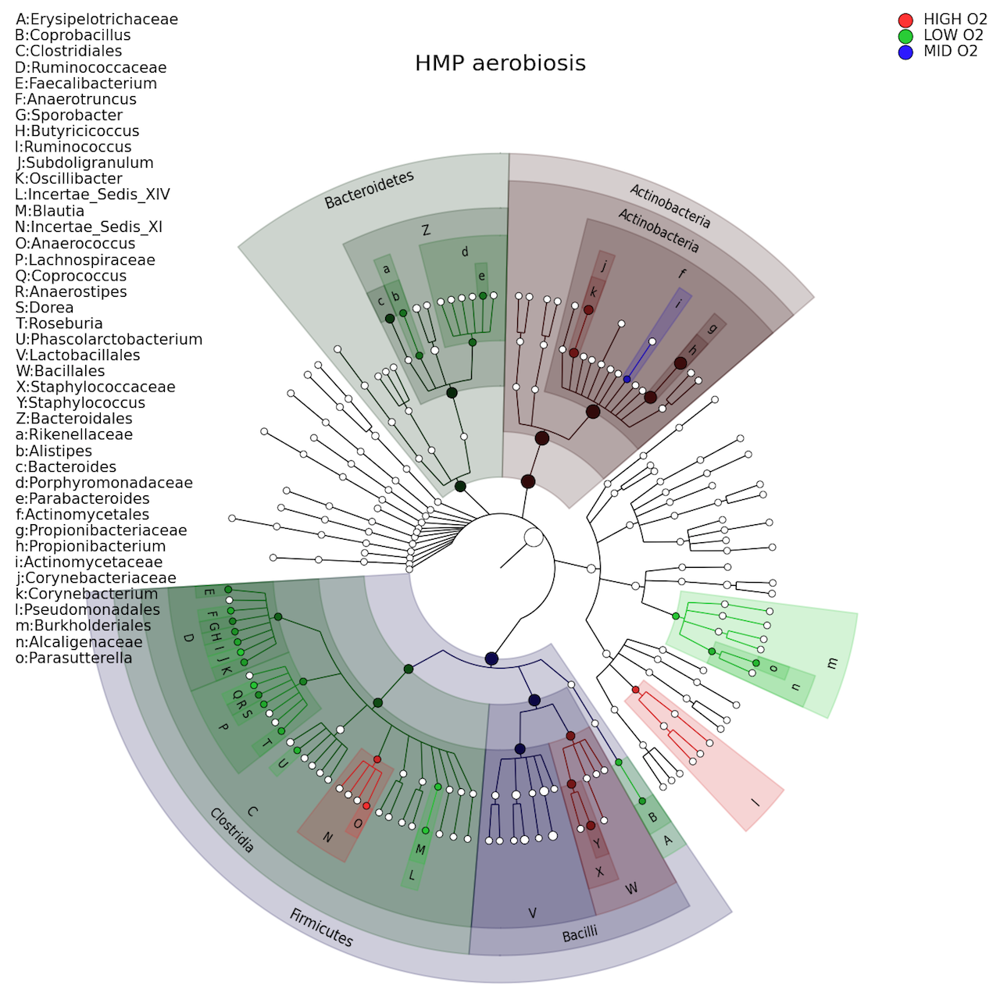

# Metagenomics
We will here look at some of the processing steps and analysis methods for working with shotgun metagenomics data.

<!-- vscode-markdown-toc -->
* 1. [Data](#Data)
* 2. [Setup](#Setup)
* 3. [Session: Metagenomic Data QC & filtering](#Session:MetagenomicDataQCfiltering)
	* 3.1. [FastQC: Quality check on raw data](#FastQC:Qualitycheckonrawdata)
	* 3.2. [fastp: Trimming and filtering](#fastp:Trimmingandfiltering)
	* 3.3. [[Optional] Host removal using Bowtie2](#OptionalHostremovalusingBowtie2)
* 4. [Session: Taxonomic Profiling](#Session:TaxonomicProfiling)
	* 4.1. [Kraken: Taxonomic classification](#Kraken:Taxonomicclassification)
	* 4.2. [Krona: Visualization of taxonomic classification](#Krona:Visualizationoftaxonomicclassification)
	* 4.3. [MetaPhlAn: Taxonomic profiling](#MetaPhlAn:Taxonomicprofiling)
	* 4.4. [[Optional] Kraken taxonomic filtering](#OptionalKrakentaxonomicfiltering)
* 5. [Session: Metagenome Assembly](#Session:MetagenomeAssembly)
	* 5.1. [Single assembly](#Singleassembly)
* 6. [Assessing the assembly](#Assessingtheassembly)
	* 6.1. [Bandage assembly graph](#Bandageassemblygraph)
* 7. [Session: Binning & Reconstruction](#Session:BinningReconstruction)
	* 7.1. [MaxBin: Binning of metagenomic contigs](#MaxBin:Binningofmetagenomiccontigs)
* 8. [Session: MAG Assembly Assessment](#Session:MAGAssemblyAssessment)
	* 8.1. [QUAST: Assembly quality assessment](#QUAST:Assemblyqualityassessment)
	* 8.2. [BUSCO: Genome completeness assessment](#BUSCO:Genomecompletenessassessment)
* 9. [Session: Functional Annotation](#Session:FunctionalAnnotation)
	* 9.1. [Prokka: Genome annotation](#Prokka:Genomeannotation)
	* 9.2. [HUMAnN2: Functional profiling](#HUMAnN2:Functionalprofiling)
	* 9.3. [AMR++: Antimicrobial resistance gene detection](#AMR:Antimicrobialresistancegenedetection)
* 10. [Session: Pipelines with Nextflow](#Session:PipelineswithNextflow)
* 11. [Session: Public Databases and Resources](#Session:PublicDatabasesandResources)
	* 11.1. [MG-RAST:](#MG-RAST:)

<!-- vscode-markdown-toc-config
	numbering=true
	autoSave=true
	/vscode-markdown-toc-config -->
<!-- /vscode-markdown-toc -->

##  1. <a name='Data'></a>Data 
Here we will work with a selection of paired-end illumina data from a study on termite gut bacterial communities:
>  _**Phylogenomic analysis of 589 metagenome-assembled genomes encompassing all major prokaryotic lineages from the gut of higher termites**_ Herve et. al, (2020) [10.7717/peerj.8614](https://peerj.com/articles/8614)

However in that study, the detail on the metagenome assemblies only says: "Metagenomic libraries were prepared, sequenced, quality controlled, and assembled at the Joint Genome Institute", where they use the  IMG/M ER pipeline. 

Here we'll do the steps ourselves and see what our findings are, and whether there are differences we see.

 In the folder `~/Shared_folder/Metagenomics/fastq` we have 6 shotgun metagenome samples that were generated in that study:

| SampleID (SRA) | StudyID (the paper) | Species | Food Type |
| ---------|----------|---------|-----------|
| SRR10512955 | Emb289P1 | _Embiratermes neotenicus_ | humus feeder |
| SRR10512954 | Emb289P3 | _Embiratermes neotenicus_ | humus feeder |
| SRR10512953 | Emb289P4 | _Embiratermes neotenicus_ | humus feeder |
| SRR10512952 | Lab288P1 | _Labiotermes labralis_ | soil feeder |
| SRR10512951 | Lab288P3 | _Labiotermes labralis_ | soil feeder |
| SRR10512950 | Lab288P4 | _Labiotermes labralis_ | soil feeder |

In this workshop we will process and analyse these samples, and then afterwards I recomend you try processing the full 30 samples to get further practice!

The commands that are listed below are to work with just one sample at a time. To process multiple samples together we can use the looping methods described in [Looping in Linux](Looping_in_linux.md), but for now pick one sample to complete the process for.

In the following examples I have used ${sampleID} in place of the name of the file. You could replace each individually, or assign it at the beginning of the session:

```
# Example:
export sampleID=SRR10512955_1pc
echo ${sampleID}_R1.fastqc.gz
```


##  2. <a name='Setup'></a>Setup
Before starting first make a new directory to do your analysis in, and enter it:

```
cd ~
mkdir metagenomics
cd metagenomics
```

##  3. <a name='Session:MetagenomicDataQCfiltering'></a>Session: Metagenomic Data QC & filtering

The first step is (as always) to check and clean our data. Initially for low quality and contamination with adapters the same as all NGS data, then we want to (usually) remove any eukaryotic host or microbial contamination depending on your domain of interest so that it does not get assessed or assembled with your intended community data.

**Programs:** FastQC, fastp, bowtie2

###  3.1. <a name='FastQC:Qualitycheckonrawdata'></a>FastQC: Quality check on raw data
Look for high overall quality scores, minimal adapter contamination, and consistent read lengths. Identify any sequences with low-quality bases that may need trimming.

- **Input:** Raw sequencing reads in FASTQ format (e.g., raw.fastq.gz).

- **Output:** HTML quality reports (e.g., fastqc_report.html).

**Time:** 
- 1% data: 30 seconds
- 10% data: 5 minutes

```
# FastQC: Quality check on raw data
mkdir qc_reports
fastqc -o qc_reports/ \
    -t 2 \
    ~/Shared_folder/Metagenomics/fastq/${sampleID}*.fastq.gz
```

###  3.2. <a name='fastp:Trimmingandfiltering'></a>fastp: Trimming and filtering
Verify that low-quality bases and adapters have been removed. Check the report for the percentage of reads retained and overall improvement in read quality.

- **Input:** Raw sequencing reads in FASTQ format (e.g., raw.fastq.gz).

- **Output:** Cleaned and trimmed FASTQ files (e.g., trimmed.fastq.gz), HTML report (e.g., fastp_report.html).

**Time:** 
- 1% data: 1.5 minutes
- 10% data: 10 minutes

```
# fastp: Trimming and filtering
# Basic fastp command example:
fastp -i ${sampleID}_R1.fastq.gz \
    -o ${sampleID}_trimmed_R1.fastq.gz \
    -h ${sampleID}.fastp_report.html

# Real command!
mkdir trim_fastq
fastp   -i ~/Shared_folder/Metagenomics/fastq/${sampleID}_R1.fastq.gz \
        -I ~/Shared_folder/Metagenomics/fastq/${sampleID}_R2.fastq.gz \
        -o trim_fastq/${sampleID}_trim_R1.fastq.gz \
        -O trim_fastq/${sampleID}_trim_R2.fastq.gz \
        --cut_front \
        --cut_tail \
        --cut_window_size 4 \
        --cut_mean_quality 30 \
        --qualified_quality_phred 30 \
        --unqualified_percent_limit 30 \
        --n_base_limit 5 \
        --length_required 80 \
        --detect_adapter_for_pe \
        -w 4
```

Now would be a good time to repeat the fastqc process, to see how the data has changed compared to the raw data!

###  3.3. <a name='OptionalHostremovalusingBowtie2'></a>[Optional] Host removal using Bowtie2
Depending on if you are assembling a host-associated metagenome then you likely will want to make sure that the sequences from the host have been removed before assembly. However, this requires you to have the host genome available.

If you don't have a reference genome, or you are working with eukaryotes you can use Kraken (next section) to match all non-target sequences and remove it that way.

Note: It's important to check the number of reads before and after host removal to confirm successful decontamination and still having enough data to continue with!

- **Input:** Trimmed FASTQ files (e.g., trimmed_data.fastq.gz), host genome reference (e.g., host_genome.fa).

- **Output:** Non-host reads in FASTQ format (e.g., non_host_reads.fastq.gz).

**Time:** 
- 1% data: 5 minutes
- 10% data: 20 minutes

**IMPORTANT:** In this workshop we don't have a good related termite reference genome so don't perform this step. It is especially useful when working with model organisms (i.e. human/mouse gut)

```
# Host removal With Bowtie2
# First we have to build an index from the host genome
bowtie2-build host_genome.fa genome_index

# Now we can map our data against it
bowtie2 -x genome_index \
    -1 ${sampleID}_trim_R1.fastq.gz \
    -2 ${sampleID}_trim_R2.fastq.gz \
    --un-conc-gz fastq/${sampleID}-clean.fastq.gz \
    -S fastq/${sampleID}-aligned.sam
```

##  4. <a name='Session:TaxonomicProfiling'></a>Session: Taxonomic Profiling
Lets see what's in our data! Here we can examine the abundance of various taxa. High read counts for specific taxa can indicate dominant organisms and give us a semi-quantitative overview of our metagenome. Be sure to check the classification is consistent with expected microbial communities.

**Programs:** Kraken, MetaPhlAn

###  4.1. <a name='Kraken:Taxonomicclassification'></a>Kraken: Taxonomic classification
Kraken database is a large collection of example microbial genomes, and by aligning each of our data reads we can get information on what can be identified in our community.

- **Input:** trimmed or non-host reads in FASTQ format (e.g., non_host_reads.fastq.gz) depending on the previous step, Kraken database.

- **Output:** Classification results (e.g., kraken_output), report file (e.g., kraken_report).

**Time:** 
- 1% data: 5 minutes
- 10% data: 20 minutes

```
# Basic command
kraken2 --db kraken_db \
    --paired ${sampleID}_trim_R1.fastq.gz \
             ${sampleID}_trim_R2.fastq.gz \
    --output ${sampleID}-kraken_output \
    --report ${sampleID}-kraken_report

# Full command including separating classified/unclassified
mkdir krakendir
singularity exec --bind /home/Shared_folder/kraken_standard  ~/Shared_folder/singularities/kraken2.sif kraken2 \
	--paired \
	--db /home/Shared_folder/kraken_standard \
	--output krakendir/${sampleID}-kraken2_output \
	--report krakendir/${sampleID}-kraken2_report \
	--classified-out krakendir/${sampleID}#.classified.fastq \
	--unclassified-out krakendir/${sampleID}#.unclassified.fastq \
	--threads 4 \
	trim_fastq/${sampleID}_trim_R1.fastq.gz trim_fastq/${sampleID}_trim_R2.fastq.gz
```

###  4.2. <a name='Krona:Visualizationoftaxonomicclassification'></a>Krona: Visualization of taxonomic classification

We can look at the kraken report that is made, but also we can use a program named Krona to interact with the taxonomic composition visually. Use the interactive chart to drill down into specific taxa and their relative abundances.

- **Input:** Taxonomic classification report (e.g., kraken_report).

- **Output:** Interactive HTML chart (e.g., krona_chart.html).

**Time:**
- Any data: instant
```
# Krona: Visualization of taxonomic classification
mkdir krona
singularity exec ~/Shared_folder/singularities/krona_2.7.1--e7615f7.sif \
    ktImportTaxonomy krakendir/${sampleID}-kraken2_report \
     -o krona/${sampleID}-krona.html
```
Open the html and explore the data:


###  4.3. <a name='MetaPhlAn:Taxonomicprofiling'></a>MetaPhlAn: Taxonomic profiling
MetaPhlAn does a similar task but using a different methodology (using bowtie2 in the background). It is good to cross-check results with Kraken for consistency. Look for unexpected taxa that may indicate contamination or novel findings.

- **Input:** Non-host reads in FASTQ format (e.g., non_host_reads.fastq.gz).

- **Output:** Taxonomic profile file (e.g., metaphlan_profile.txt).

**Time:** 
- 1% data: 4 minutes
- 10% data: 20 minutes

```
# MetaPhlAn: Taxonomic profiling
mkdir metaphlan

# We need to activate the metaphlan environment before running the command
conda activate mpa

# Note the comma between the file names!
metaphlan trim_fastq/${sampleID}_trim_R1.fastq.gz,trim_fastq/${sampleID}_trim_R2.fastq.gz     \
    --input_type fastq     \
    --bowtie2out metaphlan/${sampleID}-metaphlan.bz2  \
    --nproc 4    \
    -o metaphlan/${sampleID}-metaphlan_profile.txt \
    --bowtie2db  /opt/miniconda3/envs/mpa/lib/python3.7/site-packages/metaphlan/metaphlan_databases 
```

We can investigate the output file in a spreadsheet to check the abundances, but it can also be graphically processed with graphlan (We won't do this now, but you can [**follow a tutorial here**]([https://github.com/biobakery/biobakery/wiki/metaphlan3#create-a-cladogram-with-graphlan])). 

This becomes especially useful if we combine multiple samples and generate a cladogram like so:



###  4.4. <a name='OptionalKrakentaxonomicfiltering'></a>[Optional] Kraken taxonomic filtering
Now we have classified our reads, we could filter out based on the taxonomic classification, for example removing eukaryotic classified sequences.

Here we use the extract_kraken_reads from KrakenTools.

Note: taxID 2759 relates to eukaryotes, and --include-children means every taxID in that umbrella.

**Time:** 
- 1% data: 3 minutes
- 10% data: 10 minutes

```
/home/Shared_folder/kraken_standard/extract_kraken_reads.py \
       -k krakendir/${sampleID}-kraken2_output \
       -r krakendir/${sampleID}-kraken2_report \
       -s1 trim_fastq/${sampleID}_trim_R1.fastq.gz \
       -s2 trim_fastq/${sampleID}_trim_R2.fastq.gz \
       --exclude --include-children --taxid 2759  \
       --fastq-output \
       -o trim_fastq/${sampleID}_tf_R1.fastq \
       -o2 trim_fastq/${sampleID}_tf_R2.fastq
```

##  5. <a name='Session:MetagenomeAssembly'></a>Session: Metagenome Assembly
Now we have an idea of what is going on in our data overall. But we want to actually re-construct the actual genomes so that we can see fully what's going on. Or at least MAGs. There are many (MANY) tools to do this step, but today we'll focus on one named SPADES. 

An alternative popular tool is MEGAHIT which runs faster and uses less computing resources, but less accurate as spades has powerful correction steps built in.

Once we've assembled, we want to check the length and quality of contigs and see how complete our genome is. Longer contigs indicate better assembly (usually).

###  5.1. <a name='Singleassembly'></a>Single assembly with spades

- **Input:** Paired non-host reads in FASTQ format (e.g., non_host_reads_R1.fastq.gz, non_host_reads_R2.fastq.gz).
- **Output:** Assembled contigs in FASTA format (e.g., spades_output/contigs.fasta).

**Time:**
- 1% data: 45 minutes
- 10% data: 180 minutes

**NOTE:** The output from extract_kraken_reads.py is a fastq file, not a fastq.gz file! We could gzip it if we wanted, but for ease we will use it as is:

```
# SPAdes: Co-assembly example
mkdir spades
singularity exec ~/Shared_folder/singularities/spades_latest.sif \
    spades.py --meta \
        -1 trim_fastq/${sampleID}_tf_R1.fastq \
        -2 trim_fastq/${sampleID}_tf_R2.fastq \
        -o spades/${sampleID} \
        -t 4
```

##  6. <a name='Assessingtheassembly'></a>Assessing the assembly
We can read the information in the spades log files, and we can use quast (see below) to calculate some statistics. But also, lets visualise our data a little first using Bandage:

Download here: https://rrwick.github.io/Bandage/

You have two spades outputs that show the assembly graph: `assembly_graph.fastg` and `assembly_graph_with_scaffolds.gfa`. We can try both and see the impact of the scaffolding process within spades. This is also something that can be more powerful with long read data included in the assembly

###  6.1. <a name='Bandageassemblygraph'></a>Bandage assembly graph
Load one of the assembly files and select `Depth range` for the scope before pressing `Draw graph`. You should get something like this.


If you wanted, you can take the sequence and blast it to get an identity here, but we have some more steps to complete our assembly first!


##  7. <a name='Session:BinningReconstruction'></a>Session: Binning & Reconstruction
So far we have all of our assembled metagenomes/MAGs in one file together. That gives an overview of the whole community, but we also want to identify which contigs are from the same organism so that we can know which pathways originate together. Here we can use binning to predict which contigs are linked

**Programs:** MaxBin, CONCOCT

###  7.1. <a name='MaxBin:Binningofmetagenomiccontigs'></a>MaxBin: Binning of metagenomic contigs


- **Input:** Assembled contigs in FASTA format (e.g., contigs.fasta), abundance file (e.g., abundance_file.txt).

- **Output:** Binned contigs in separate FASTA files (e.g., maxbin_output/bin.001.fasta).

```
# MaxBin: Binning of metagenomic contigs
mkdir binned
run_MaxBin.pl -contig spades/${sampleID}/contigs.fasta \
    -out binned/${sampleID}/ \
    -reads trim_fastq/${sampleID}_tf_R1.fastq \
    -reads2 trim_fastq/${sampleID}_tf_R2.fastq
```


##  8. <a name='Session:MAGAssemblyAssessment'></a>Session: MAG Assembly Assessment
Now we need to evaluate the assembly for each sample. Compare the contig statistics across samples to work out if assembly went well and identify variability between samples in assembly quality, and then we can look to see whether the MAGs have the expected genes in their assemblies

**Programs:** QUAST, BUSCO

###  8.1. <a name='QUAST:Assemblyqualityassessment'></a>QUAST: Assembly quality assessment
Quast lets us look at key metrics such as N50, total length, and number of misassemblies. This is mostly relevant on a single genome level, but it has a metaquast approach to assess our metagenome assembly.

Higher N50 and fewer misassemblies indicate better assembly quality.

- **Input:** Assembled contigs in FASTA format (e.g., spades_output/contigs.fasta).

- **Output:** Quality assessment report in HTML format (e.g., quast_report.html).

```
# QUAST: Assembly quality assessment
singularity exec docker://reslp/quast:5.0.2 \
    quast.py spades/${sampleID}/contigs.fasta \
        -o spades/${sampleID}-quast_report/
```

###  8.2. <a name='BUSCO:Genomecompletenessassessment'></a>BUSCO: Genome completeness assessment
Check the percentage of complete, single-copy gene orthologs. High completeness and low duplication rates indicate high-quality MAGs.

- **Input:** Assembled contigs in FASTA format (e.g., contigs.fasta).

- **Output:** Completeness report (e.g., busco_output/short_summary.txt).

```
# BUSCO: Genome completeness assessment
singularity exec docker://ezlabgva/busco:v5.3.2_cv1 \
    busco --in spades/${sampleID}/contigs.fasta  \
          --out spades/${sampleID}-busco_report/ \
          -l bacteria_odb10 \
          --mode genome \
          -c 4 -f 
```


##  9. <a name='Session:FunctionalAnnotation'></a>Session: Functional Annotation
We now have genomes, partial genomes, or MAGs. But right now they are only DNA sequences with no associated information. We next need to perform some gene predictions on our contigs to find out their functional capacities and have annotated genomes for our downstream assessment.

**Programs:** Prodigal, Prokka, HUMAnN2, AMR++

###  9.1. <a name='Prokka:Genomeannotation'></a>Prokka: Genome annotation
Prokka is really the most powerful and well-used bacterial genome annotation tool. It will predict genes, RNAs, annotate the genome and Check the annotation completeness and accuracy. And it's really easy to use!

- **Input:** Assembled contigs in FASTA format (e.g., contigs.fasta).

- **Output:** Annotated genome files (e.g., prokka_output/sample.gff, sample.faa).

```
# Prokka: Genome annotation
prokka ${sampleID}-spades/contigs.fasta \
    --outdir ${sampleID}-prokka \
    --prefix ${sampleID}
```

###  9.2. <a name='HUMAnN2:Functionalprofiling'></a>HUMAnN2: Functional profiling
Here we can test the abundance and coverage of metabolic pathways and gene families. High abundance pathways may indicate dominant metabolic capabilities of the community.

- **Input:** Non-host reads in FASTQ format (e.g., non_host_reads.fastq.gz).

- **Output:** Functional profile tables (e.g., humann2_output/pathabundance.tsv, pathcoverage.tsv).

```
# HUMAnN2: Functional profiling
humann2 --input non_host_reads.fastq.gz --output humann2_output/
```

###  9.3. <a name='AMR:Antimicrobialresistancegenedetection'></a>AMR++: Antimicrobial resistance gene detection
AMR++ isn't just one tool, but a whole nextflow pipeline that does a lot of the steps above. However it uses the really powerful MegaRES database for identifing and quantifying AMR genes present, so we can jump straight to that stage in our process. High abundance of AMR genes may suggest significant resistance potential in the microbial community.

- **Input:** Non-host reads in FASTQ format (e.g., non_host_reads.fastq.gz).

- **Output:** AMR gene detection report (e.g., amr_output/report.txt).

```
# AMR++: Antimicrobial resistance gene detection
[THIS IS WRONG COMMAND] amrplusplus_pipeline.sh -i non_host_reads.fastq.gz -o amr_output/
```


##  10. <a name='Session:PipelineswithNextflow'></a>Session: Pipelines with Nextflow
Everything we have done so far has been step-by-step through some of the essential processes. However we can also use more powerful pipeline languages to enhance reproducibility and efficiency. Nextflow is an incredibly powerful system for handling large workflows and also has a number of high quality pipelines published that you can work with.

It can be complex to set up, but incredibly useful and time saving if you put in the effort to learn the systems.

**Programs:** [nf-core/mag](https://nf-co.re/mag/3.0.0)
- **Input:** Raw sequencing reads, configuration files for the pipeline.

- **Output:** Comprehensive set of results including assembled contigs, binned genomes, and annotations.

```
# Nextflow: Running nf-core/mag pipeline
nextflow run nf-core/mag -profile test,docker
```

##  11. <a name='Session:PublicDatabasesandResources'></a>Session: Public Databases and Resources
One incredibly important aspect of working with metagenomics is understanding how the your samples relate to the other published research. Therefore, having methods to compare your results are incredibly useful. 

**Programs:** MG-RAST

###  11.1. <a name='MG-RAST:'></a>MG-RAST:
Utilize MG-RAST’s tools for further analysis and comparison with public datasets.

- **Input:** Processed metagenomic reads.

- **Output:** Annotated metagenomic data on the MG-RAST platform.

Web-based, access via https://www.mg-rast.org/
