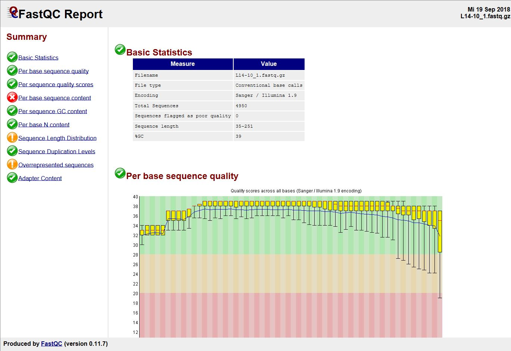
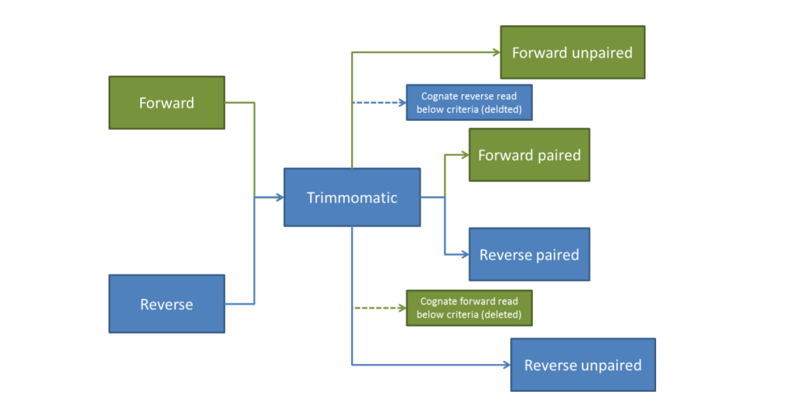

## Quality assessment, Trimming and Manipulation of NGS data 
### Setup
If you have already copied the Day1 folder, move into it using ```cd```. Otherwise, this should be in: 
```
~/Share/Day1
```
Use ls to check that you can see the data in this folder.

### Contents
- [FastQC](#fastqc)
- [Manipulating data with SEQTK](#manipulating-data-with-seqtk)
- [FastP](#fastp)
- [Trimmomatic](#trimmomatic)


## FastQC 
Summary: FastQC is a program that generates a suite of pre-determined reports and graphs documenting the quality and raw next generation sequence data. FastQC requires a FastQ, Colorspace FASTQ (SOLiD), GZip compressed FASTQ, SAM, BAM, SAM/BAM Mapped only (normally used for colorspace data) as input file. FastQC can operate in two different modes – as a stand-alone interactive application or as a command line non-interactive mode.  We will use it in Commandline mode.

Source: http://www.bioinformatics.bbsrc.ac.uk/projects/fastqc/ (They also have further guides to analysis modules and examples of good and poor data. Also there is a link to a video tutorial!)

__Example Output__


### Exercises
1.  CHECKING FASTQ FILE QUALITY

Navigate to the directory containing your fastq file then assess it with fastQC using the command:
```
$ fastqc Illumina_1.fastq
```
This will generate a .html output file with the same name and one with _fastqc.zip added.

2. Transfer the html file to your desktop and open with a browser to explore the data.

When you have lots of samples it can be tiresome to look at each individually! We can use the MultiQC program for when you have many samples to view together. We will look at this later in the week.


## Manipulating data with SEQTK  

Summary: ```seqtk``` is a fast and lightweight toolbox for processing sequences in the FASTA or FASTQ format. It seamlessly parses both FASTA and FASTQ files, and allows data manipulation and summary. 

Source: https://github.com/lh3/seqtk 

It runs using the following format:
```
$ seqtk [command] [options] input.fastq > output.fasta
```
If you run ```seqtk``` with no parameters, it will show you the available options. Run ```seqtk``` and then ```seqtk seq```, and it will give you the manual for just the ```seq``` function.

### EXAMPLES: Here are some potentially useful seqtk applications:
__Convert from fastq to fasta:__
```
$ seqtk seq [options] Illumina_1.fastq > Illumina_1.fasta
[Options]
   -A    |  Force the output in fasta format
   -C    | discard the header comments
   -q 10 |  mask low quality bases (<10)
```
__Reverse complement FASTA/Q:__
```
$ seqtk seq -r in.fq > out.fq
```

__Subsample 10000 read pairs from a large FASTQ file__

Note: If you want to use this with paired data, remember to use the same random seed to keep pairing
```
$ seqtk sample in.fq 1000 > out-1000.fq
```

### EXERCISE: MANIPULATING FASTQ DATA
Here, I have written the tasks in normal language. The challenge for you is to convert this into the commands and code to do the processes! Remember that you can type the command with no parameters to be given the options.
1. Convert the FASTQ file into FASTA format using seqtk seq
2. Run seqtk trimfq to see the parameter options
3. Choose which parameters to use with seqtk trimfq to remove 10 bp from the end of the Illumina FASTQ dataset 
4. Re-run fastQC on the output of the trimming process and see how this has affected the data.

## FastP
Summary: A tool designed to provide fast all-in-one preprocessing for FastQ files. This tool is developed in C++ with multithreading supported to afford high performance.

Source: https://github.com/OpenGene/fastp 

A selection of key features they boast of:
* Comprehensive quality profiling for both before and after filtering data (quality curves, base contents, KMER, Q20/Q30, GC Ratio, duplication, adapter contents...)
* Filter out bad reads (too low quality, too short, or too many N...)
* Cut low quality bases for per read in its 5' and 3' by evaluating the mean quality from a sliding window (like Trimmomatic but faster).
* Cut adapters. Adapter sequences can be automatically detected, which means you don't have to input the adapter sequences to trim them.
* Correct mismatched base pairs in overlapped regions of paired end reads, if one base is with high quality while the other is with ultra low quality
* Trim polyG in 3' ends, which is commonly seen in NovaSeq/NextSeq data. Trim polyX in 3' ends to remove unwanted polyX tailing (i.e. polyA tailing for mRNA-Seq data)
* Visualise quality control and filtering results on a single HTML page (like FASTQC but faster and more informative).
* Split the output to multiple files (0001.R1.gz, 0002.R1.gz...) to support parallel processing. Two modes can be used, limiting the total split file number, or limiting the lines of each split file.
* Support long reads (data from PacBio / Nanopore devices).

It is very simple to run in basic mode:
```
$ fastp --in1 Input_1.fastq    --in2 Input_2.fastq    \
        --out1 trimmed_1.fastq --out2 trimmed_2.fastq
```

### EXERCISE: fastp trimming and QC check

1. Use fastp with defaults parameters to process the illumina paired end data and inspect the html output file
2. Use the --cut_right parameter to apply a sliding window filtering. Default is Q20 Try with a quality filter of >30.
3. Repeat the fastQC assessment of the resulting file

<details>
  <summary>
  
  ### EXTENSION
  
  </summary>
    4. Use the “merge” parameter to combine the overlapping paired end reads into contigs. What proportion overlap?
    5. Repeat FastQC on this new output

</details>

## Trimmomatic 
**Note**: I have included trimmomatic here for historic purposes. It is still a major tool and part of many people's pipelines, however I adivse people to use fastp now.

__Summary__: Trimmomatic is (was) a fast, multithreaded command line tool that can be used to trim and crop Illumina (FASTQ) data as well as to remove adapters. These adapters can pose a real problem depending on the library preparation and downstream application. 

Source: http://www.usadellab.org/cms/?page=trimmomatic 

### Trimmomatic QC steps (they process in this order):
- ILLUMINACLIP: Cut adapter and other illumina-specific sequences from the read. 
- SLIDINGWINDOW: Performs a sliding window trimming approach. It starts scanning at the 5‟ end and clips the read once the average quality within the window falls below a threshold. 
- MAXINFO: An adaptive quality trimmer which balances read length and error rate to maximise the value of each read 
- LEADING: Cut bases off the start of a read, if below a threshold quality 
- TRAILING: Cut bases off the end of a read, if below a threshold quality CROP: Cut the read to a specified length by removing bases from the end 
- HEADCROP: Cut the specified number of bases from the start of the read 
- MINLEN: Drop the read if it is below a specified length 
- AVGQUAL: Drop the read if the average quality is below the specified level 

Trimmomatic output files are named _1P and _2P for good quality passing paired, and _1U and _2U for good quality reads but without a corresponding pair anymore.

Using TRIMMOMATIC to clean NGS data.
By default, Trimmomatic performs a range of quality control steps and autodetection of Illumina adapter sequences, which then trims them from each of the sequencing reads that they appear in. Use the Trimmomatic help page to devise the command that you want to run, remembering that there are lots of helpful things done by default. A suggested command is below:

### For single end data
```
$ trimmomatic SE inputFile.fastq outputFile.fastq [parameters]
```
### For paired end data
```
$ trimmomatic PE inputFile1_1.fastq inputFile_2.fastq -baseout samples_trimmo.fastq [parameters]
```

You must also provide the parameters for trimming. Below is a good default set that you shouldn’t need to change unless with noisy data. The [parameters]:
```
ILLUMINACLIP:/home/ubuntu/Share/bin/Trimmomatic-0.39/adapters/TruSeq3-PE.fa:2:30:10 LEADING:3 TRAILING:3 SLIDINGWINDOW:4:15
```

Note: You will need to change the adapter file based on if you are using single/paired data.



<details>
  <summary>
  
  ### EXTENSION EXERCISE: Clean the data with Trimmomatic
  
  </summary>

1. Run paired end trimmomatic with Illumina_1.fastq and Illumina_2.fastq. Don’t forget to include the parameters!
2. Now run fastQC again on the clean and see how it has improved/changed the data.
3. Make the sliding window quality requirement more restrictive by increasing from 15 to 30 to see the effect.
4. Contrast Trimmomatic & fastp QC processes
</details>
